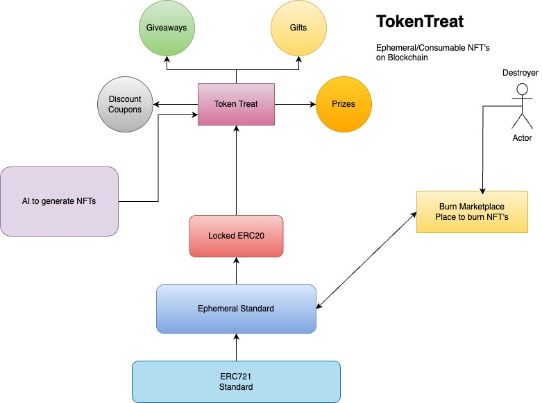

TokenTreat(Ephemeral NFT's on CrossFi)

## Overview
TokenTreat brings ephemeral NFTs to the crossfi blockchain, allowing NFTs to have expiration dates and enabling a wide range of new use cases such as discount coupons, certificates, and giveaways. Traditional NFTs lack the capability to expire automatically, which usually requires a central authority to manage and burn expired tokens. TokenTreat addresses this issue by introducing a modified ERC-721 standard that includes expiration logic and a decentralized burn mechanism.

## Key Features
- Ephemeral NFTs: NFTs with built-in expiration dates that automatically trigger burn operations when they expire.
- Modified ERC-721 Standard: Enhanced ERC-721 standard with added expiration logic and burn functionalities.
- Decentralized Burn Marketplace: A marketplace where any user can burn expired NFTs and earn rewards for doing so.
- Token Locking: Lock ERC-20 tokens or native tokens within NFTs, making them redeemable upon claiming.
- Use Cases: Ideal for creating discount coupons, certificates, giveaways, and other time-sensitive digital assets.
- User-Friendly Platform: An easy-to-use platform for creating, managing, and interacting with ephemeral NFTs.

## How It Works
1. Create Ephemeral NFTs: Use the platform to create NFTs with specified expiration dates and token locks.
2. Claim and Redeem: Recipients can claim the NFTs, unlocking the associated tokens upon claiming.
3. Burn Expired NFTs: Once the expiration date is reached, any user can burn the expired NFTs via the burn marketplace and receive rewards.

Visit the TokenTreat platform to create and manage your ephemeral NFTs. The platform provides a dashboard to track claimable treats, monitor expirations, and manage burns. Experience the full functionality by issuing discount coupons, giveaways, and more.

## Video Demo
https://www.loom.com/share/fe6cd96a9df14c54ad93cec44ee52855?sid=837ca78e-5c5a-4f8c-bd13-77f67879135e

## Smart Contracts

Token Treat Contract : https://test.xfiscan.com/address/0xf6b29cf96471e9bfbbb52623395759ca948f4554

## TryOut Link
https://ephemeral-opal.vercel.app/